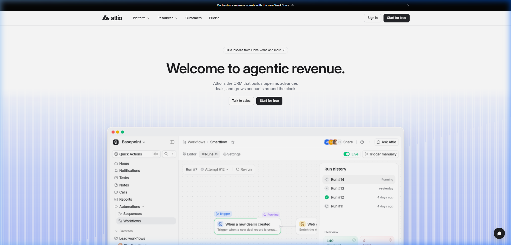
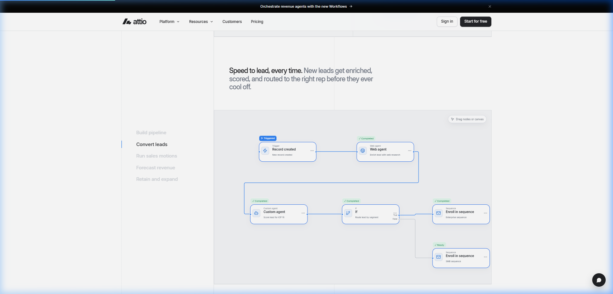
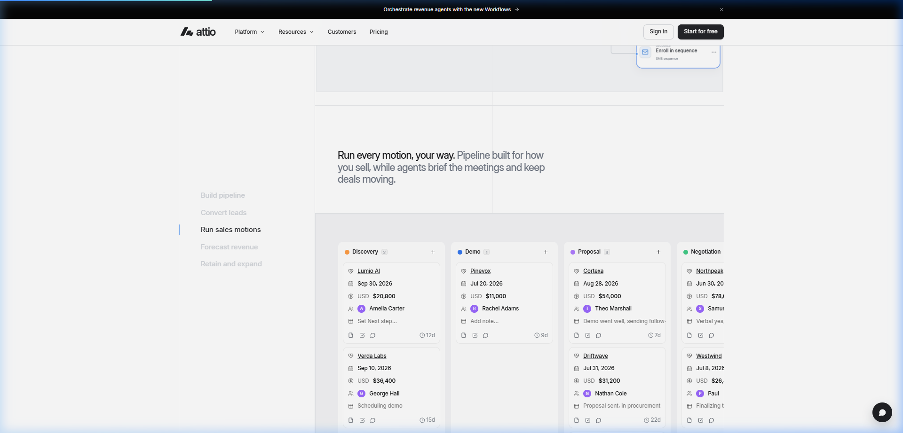
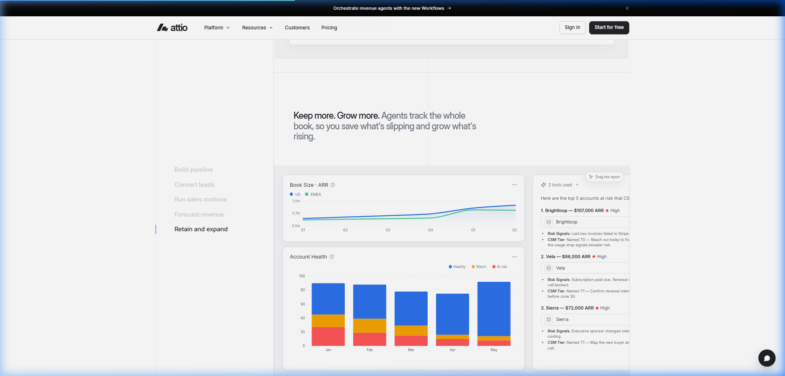

# 🚀 Attio — Agentic Revenue Platform Landing Page

<div align="center">



[](https://reactjs.org/)
[](https://vitejs.dev/)
[](https://tailwindcss.com/)
[](https://www.framer.com/motion/)
[](LICENSE)

**A pixel-perfect, highly dynamic recreation of the Attio Agentic Revenue Platform landing page.**  
*Built with modern Web technologies, interactive node graphs, responsive charts, and fluid micro-animations.*

[Live Preview](#-getting-started) • [Key Features](#-key-features) • [Screenshots](#-screenshots) • [Tech Stack](#-tech-stack)

</div>

---

## ✨ Key Features

- 🎯 **Pixel-Perfect Attio UI**: Clean design system with subtle borders, custom typography, and modern aesthetics.
- 🔀 **Interactive Workflow Builder**: Powered by `@xyflow/react` to demonstrate visual lead enrichment and agent routing graphs.
- 📋 **Kanban Deal Pipeline**: Full sales motions board with stages from Discovery to Negotiation.
- 📊 **Revenue Analytics & Charts**: Real-time forecast tools and account health tracking with `Recharts`.
- ⚡ **Framer Motion Animations**: Smooth tab switching, scroll triggers, and fluid micro-interactions.
- 🧩 **Radix UI Components**: Tooltips, Dropdowns, Tabs, and Accordions structured cleanly for scalability.

---

## 🖼️ Screenshots

<div align="center">

### 1. Hero Section & Main Landing Page


### 2. Interactive Agentic Workflow Builder (@xyflow/react)


### 3. Sales Motions & Kanban Deal Board


### 4. Account Health & Retention Analytics


</div>

---

## 🛠️ Tech Stack

| Technology | Purpose |
| :--- | :--- |
| **[React 18](https://react.dev/)** | Core UI Library & Component Architecture |
| **[Vite 6](https://vitejs.dev/)** | Next-Generation Frontend Tooling & Fast HMR |
| **[Tailwind CSS](https://tailwindcss.com/)** | Utility-first CSS framework for modern styling |
| **[Framer Motion](https://www.framer.com/motion/)** | Production-ready motion and gesture library |
| **[@xyflow/react](https://reactflow.dev/)** | Interactive Node-Based Workflow Visualizer |
| **[Recharts](https://recharts.org/)** | Composable Charting Library for React |
| **[Radix UI](https://www.radix-ui.com/)** | Unstyled, accessible UI primitive components |
| **[Lucide React](https://lucide.dev/)** | Modern & clean icon set |

---

## 🚀 Getting Started

Follow these steps to run the project locally on your machine:

### Prerequisites
Make sure you have **Node.js (v18+)** and **npm** installed.

### 1. Clone the repository
```bash
git clone https://github.com/felipenunes07/attio-landing-page.git
cd attio-landing-page
```

### 2. Install dependencies
```bash
npm install
```

### 3. Start the development server
```bash
npm run dev
```

Open your browser and navigate to `http://localhost:5173` to view the app!

### 4. Build for production
```bash
npm run build
```

---

## 📁 Project Structure

```text
attio-landing-page/
├── docs/
│   └── screenshots/         # Clean high-res UI screenshots
├── public/
│   └── assets/              # Webfonts, icons, and media
├── src/
│   ├── components/
│   │   └── ui/              # Radix UI primitive wrappers
│   ├── lib/
│   │   └── utils.js         # Tailwind merge & helper utilities
│   ├── App.jsx              # Main Landing Page Application & Workflow logic
│   ├── main.jsx             # React entrypoint
│   └── styles.css           # Global styles and design system variables
├── index.html               # HTML entry point
├── vite.config.js           # Vite configuration
├── package.json             # Dependencies and scripts
└── README.md                # Project documentation
```

---

## 📄 License

This project is licensed under the [MIT License](LICENSE).

---

<div align="center">
  Developed with ❤️ by <a href="https://github.com/felipenunes07">felipe nunes 07</a>
</div>
